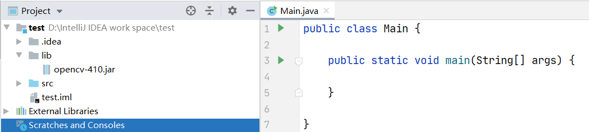
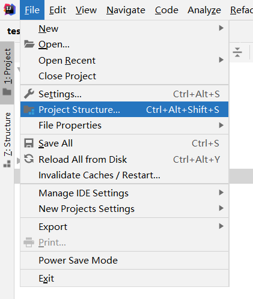
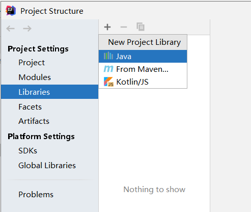

> 因为数字水印的缘故所以要使用到OpenCV，下来便是对OpenCV安装的简单教程

OpenCV安装地址：https://opencv.org/releases/

选择OpenCV的版本号：


下载完成后，点击exe，然后next就可以了。

打开文件：opencv\build\java


在IDEA中创建一个简单的java项目




导入opencv-410.jar





进入界面以后





导入opencv的jar即可。


配置动态连接库：
方式一：
-Djava.library.path=opencv的动态链接库地址

eg：-Djava.library.path=C:\Users\Fenix\Desktop\opencv\build\java\x64


测试程序

```java
import org.opencv.core.Core;
import org.opencv.core.CvType;
import org.opencv.core.Mat;
public class Main {
    public static void main( String[] args )
    {
        System.loadLibrary( Core.NATIVE_LIBRARY_NAME );
        Mat mat = Mat.eye( 3, 3, CvType.CV_8UC1 );
        System.out.println( "mat = " + mat.dump() );
    }
}
```

结果：


方式二：

我们直接将动态链接库放到我们配置好的jdk的bin目录下。

