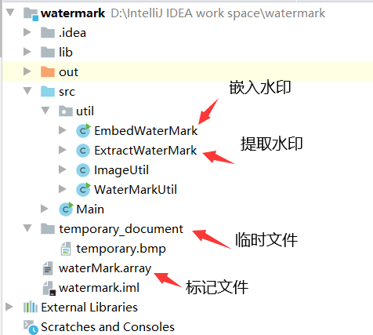
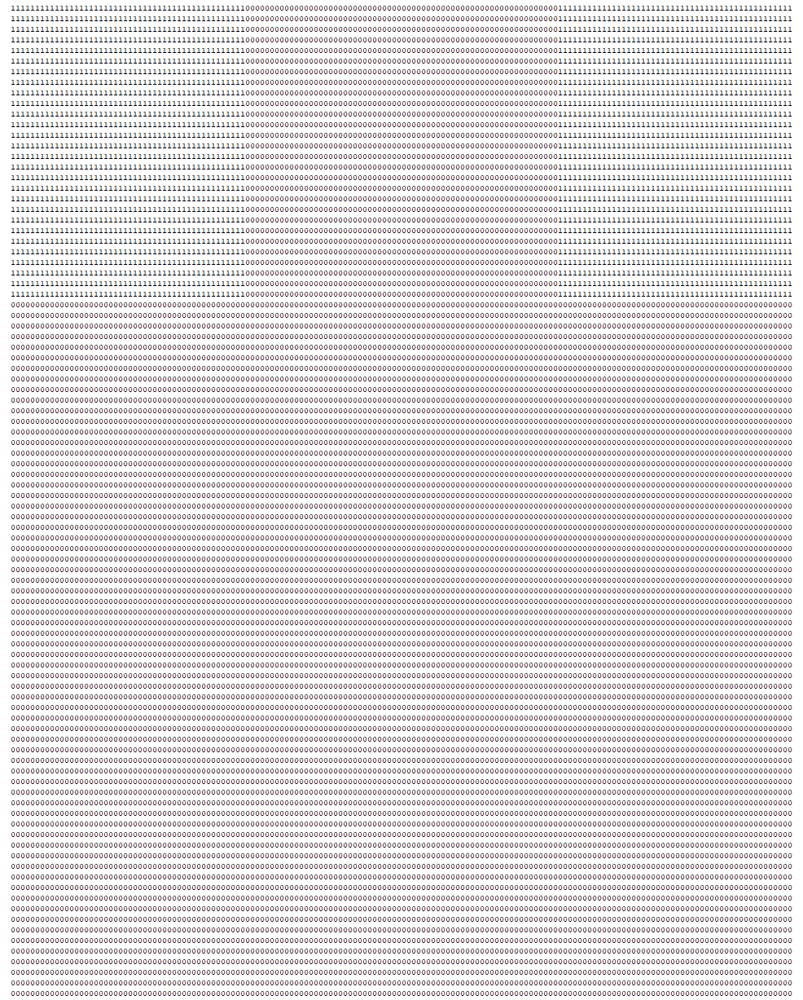
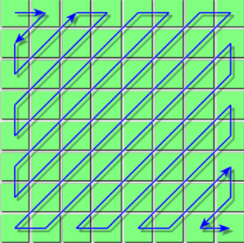
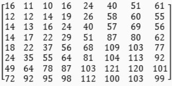

> 这个项目是在2019年的时候完成的，那个时候学校有老师组织一些学生参加大创比赛，当时想去看看这个比赛是什么所以就去参加了，而我分配的是做数字水印，所以之后就对数字水印有了一定的了解。

### 相关说明

#### 环境配置

OpenCV4.1.0

jdk1.8

IDEA

#### 核心

DCT

### 项目讲解



#### WaterMarkUtil类

1，生成和读取配置文件(即：waterMark.array文件)

​	标记文件：行120，列：160

​	对于标记文件的左上和右上角都是1，其他区域是0

​	标记文件的作用是：

​	用来解决图片任意旋转90度或者90度的整数倍的情况。

​	效果图如下：



2，将文本内容生成二值图。行：64，列：64

​	二值图：指在图像中，灰度等级只有两种，也就是说，图像中的任何像素点的灰度值均为0或者255，分别代表黑色和白色。

3，获取二值图对应的二维矩阵。

4，将二值图的二维矩阵和标记文件进行整合得到最终嵌入图片的二维数组。

#### ImageUtil类

这个类比较简单主要是用来处理图片大小和旋转的问题。

#### EmbedWaterMark类(重点)

作用：将一张64*64的二值图嵌入到图片(960行，1280列)中。

```java
//这是这个类当中最重要的一个方法
/**
* 将最终的二维数组嵌入到图片当中
* @param srcPath：图片源路径
* @param dstPath：图片目标位置
* @param waterMark：最终的二维数组
* @param p：嵌入强度
* @throws IOException
*/
public static void addWaterMarkToImage(String srcPath, String dstPath, int[][] waterMark, double p) throws IOException {
}
/*
这个嵌入强度的意思，我们将一个图片得到它的二维矩阵然后进行DCT变换，
然后将指定某个下标的值改变为P，即表示为嵌入强度。
*/
```

addWaterMarkToImage中的参数waterMark是最终嵌入的二维数组。

如何得到的waterMark？

1，读取标记文件waterMark.array得到一个120*160的二维数组。

2，读取二值图，得到对应得64*64的二维数组。

3，然后将标志文件的二维数组中的中间部分替换为二值图对应的二维数组。

```java
//得到最终的嵌入数组的方法再WaterMarkUtil类中
    /**
     * 将二维矩阵(二值图)和标志文件进行整合得到最终的嵌入图片的二维数组。
     */
    public static int[][] getWaterMark(int[][] binaryArray, int[][] tagArray){
        int[][] waterMark = tagArray;
        for(int row = 0; row < binaryArray.length; row++){
            for(int col = 0; col < binaryArray[0].length; col++){
                waterMark[row + 28][col + 48] = binaryArray[row][col];
            }
        }
        return waterMark;
    }
```

嵌入流程分析：

1，无论什么大小的图片我们都要将其处理成960(行)*1280(列)的图片。

2，通过OpenCV得到图片的YCbCr中的Y通道。

3，将Y通道分割成8*8的小块，然后将其进行DCT变换。

4，在8*8的小块中嵌入0或1。

> 重点解释一下第3步和第4步。

1，得到Y通道数组YArray[960] [1280]。
2，从左往右，从上往下，开始将Y分割成8 * 8的像素块。
3，让后将8 * 8的像素块进行DCT变换。
4，选取DCT变换后的两个坐标(1,2)和(2,1)。
5，如果我们嵌入1，那么将(1,2)对应的值变为P，(2,1)对应的值变为-p，如果我们嵌入0，那么将(1,2)对应的值变为-P，(2,1)对应的值变为p。
6，在进行IDCT变换，然后替换原来的8 * 8像素块对应的值。

> 为什么使用图片的YCbCr的Y通道，而不使用图片的RGB中的任意通道

其实在这个算法的早期我们是使用RGB通道中的R通道来实现的，最后实验发现这种方式在抵抗
JPEG压缩是性能不好，最好发现JPEG压缩的本质是基于Y通道来实现，所以直接使用Y通道抵抗
压缩的能力会强一些。

参考文章 JPEG算法解密：https://www.cnblogs.com/Arvin-JIN/p/9133745.html

> 如何去选择两个点去修改它们的系数




这张图就是8*8像素块进行DCT变换后的大致方式，在选择哪个点修改它的系数的时候我们尽量选择靠前的点，这是因为DCT变换后能量更多的集中在前面，这样的我们嵌入的强度更大，但是坏处就是改得越靠前那么对于图片质量的影响也是最大的。





这张图是JPEG的量化系数表，所以我们在选择两个点的时候尽量选择量化系数接近的两个点。


#### ExtractWaterMark类(重点)

提取流程分析：

1，无论什么大小的图片我们都要将其处理成960(行)*1280(列)的图片。

2，然后将960*1280图片进行8 * 8的分块然后比较选择两个点的大小得到嵌入的信息是0还是1，最终组成120 * 160的二维数组。

3，判断图片是否发生了旋转？

3.1，分别统计120 * 160二维数组的前28行中0和1的个数。

正常情况下，前28行，中1的个数是2688，0的个数是1792，两个之间的差值是896。所以我们可以通过这个查值来判断是否发生的旋转。在我程序中这个差值在750到1000之类我就认为没有发生旋转提取水印。

3.2，如果没有在这个范围类，那么就旋转90度，180度，270度，知道满足这个条件为止。

4，如果没有满足这个条件那么我就认为发生了裁剪。

5，如果发生了裁剪那么我们就不再是处理960 * 1280的图片了，而是处理原尺寸大小的图片。

6，因为发生了裁剪所以就破坏了原有的8 * 8的像素块的分割，所以我从图片的左上角在8 * 8的范围内移动，生成64张图片，而在64张图片中就有提取度最高的水印信息。

#### 最后

改变YCbCr中的Y通道的DCT系数来表示嵌入信息，选择两个比较相近的点，然后在改变这两个点的DCT系数，而且这两个点比较靠前(用于抵抗缩放)，通过两个点的大小关系来表示嵌入的信息。

### 优化

如果读者还想对这个算法进行一些相关调优，可以选择不同的两个点，或者改变嵌入强度(我的嵌入大小是p=100)。

### 不足

这个项目对于单一攻击还是可以抵抗的，但是对于某些混合攻击还是就力不从心了，比较旋转+裁剪，缩放+裁剪。

